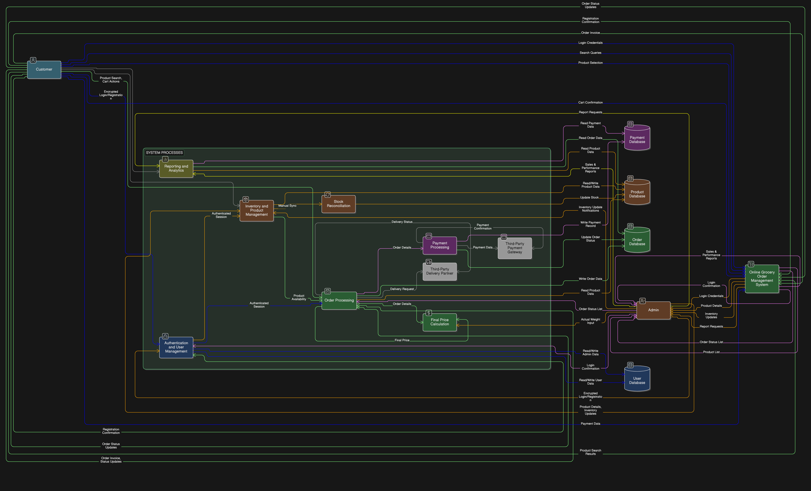
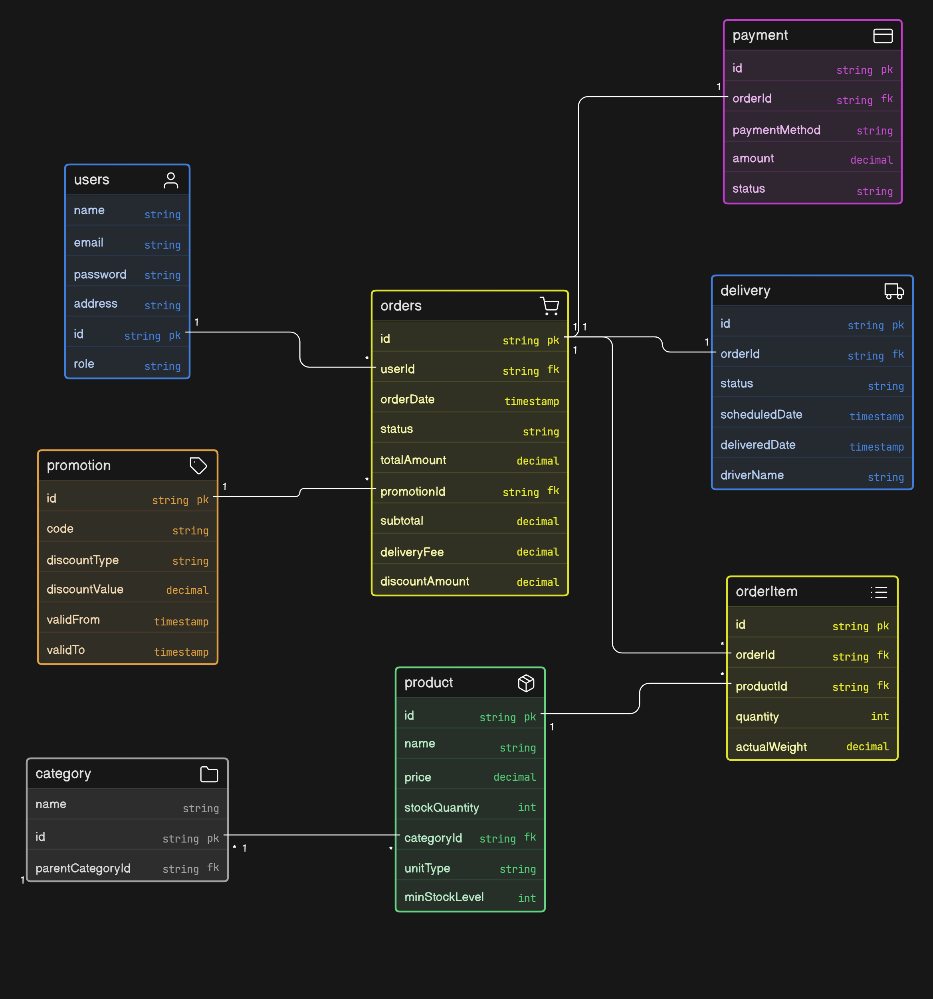

# System Analysis: Online Grocery Order Management System

---

## 1. Introduction

System analysis focuses on understanding existing systems, identifying problems, and defining the scope, data, and processes of the proposed system.

---

## 2. Study of Existing Systems

### 2.1 Existing System

Currently, many grocery stores operate using:

- Manual ordering systems  
- Basic POS (Point of Sale) systems  
- Limited or no online presence  

---

###  Inventory Mismatch Issues

- [x] **Phantom Stock:** Differences between recorded stock and actual warehouse stock  
- [x] **Lack of Reconciliation:** Systems fail to sync digital records with physical inventory  

---

###  Missing Weight Handling

- [x] **Variable Goods Error:** Systems fail to capture actual weight of items (e.g., vegetables, meat)  
- [x] **Billing Inaccuracy:** Leads to incorrect pricing and customer dissatisfaction  

---

## 3. Proposed System

The proposed system is an **Online Grocery Order Management System** that:

- Enables online product browsing and ordering  
- Automates inventory and order management  
- Provides secure payment options  
- Generates reports for administrators  

###  Key Enhancements

- [x] **Stock Reconciliation:** Synchronizes system stock with physical inventory  
- [x] **Dynamic Pricing:** Supports actual weight entry and automatic price adjustment  

---

## 4. System Scope

### 4.1 In Scope

- User registration and authentication  
- Product management with real-time stock updates  
- Cart functionality and order processing  
- Payment handling and invoice generation  
- Admin dashboard with analytics  

---

### 4.2 Out of Scope

- Integration with external delivery APIs  
- Mobile application (web-based only)  
- Advanced AI-based recommendations  

---

## 5. Data Identification

### 5.1 Main Data Entities

- **User**  
  - UserID, Name, Email, Password, Address  

- **Product**  
  - ProductID, Name, Price, Stock, Category, ActualWeight  

- **Order**  
  - OrderID, UserID, TotalAmount, Status, ReconciliationID  

- **Payment**  
  - PaymentID, OrderID, Amount, Status  

---

## 6. Process Identification

###  Key System Processes

1. **User Management**  
   - Secure authentication and profile handling  

2. **Inventory Management**  
   - Real-time stock updates  

3. **Stock Reconciliation**  
   - Synchronizing system stock with physical inventory  
   - Identifying and correcting mismatches  

4. **Order & Price Processing**  
   - Capturing actual weight during packing  
   - Updating final payable amount  

5. **Payment Processing & Reporting**  
   - Secure transactions  
   - Sales and performance analysis  

---

## 7. Data Flow Diagrams (DFD)

The following diagram represents the movement of data, including reconciliation and weight-handling processes.

>  *Figure 1: Level 1 Data Flow Diagram*

---

### 7.1 Data Flow Analysis

- **Process 3.0 – Stock Reconciliation**  
  Ensures the **Product Database** reflects real warehouse stock  

- **Process 4.0 – Order Processing**  
  Uses actual weight input to calculate the **final price**  

- **External Entities**  
  - Customers → Place orders and make payments  
  - Admin → Manage system operations  

---

## 8. ER Diagram (Database Design)
The Entity Relationship Diagram (ERD) below visualizes the database schema, ensuring data integrity and supporting the complex requirements of stock reconciliation and weight-based pricing.

*Figure 2: ER Diagram for Online Grocery Management System*

###  Entities and Relationships

* **User & Order (1:M):** A registered user can place multiple orders, but each order belongs to one specific user.
* **Order & OrderItem (1:M):** One order contains multiple products. The `actualWeight` field captures variations in fresh produce.
* **Product & Category (M:1):** Products are organized into categories and sub-categories for easier browsing.
* **Promotion & Order (1:M):** A single promotion code can be applied to multiple orders to provide discounts.
* **Order & Delivery/Payment (1:1):** Each order has a dedicated payment transaction and a delivery tracking record.

---

## 9. Conclusion

This system analysis highlights key limitations in existing systems, particularly in:

- Inventory accuracy (ghost/phantom stock)  
- Weight-based pricing  

The proposed system addresses these issues through:

- Real-time inventory synchronization  
- Stock reconciliation mechanisms  
- Dynamic pricing based on actual weight  

This document provides a strong foundation for system design and development.

---